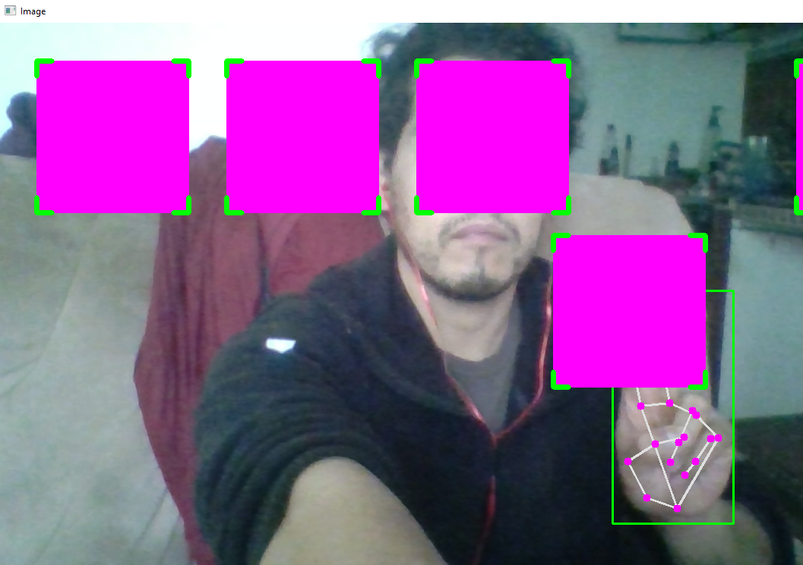

# python-OpenCV-DragBoxWithHand

Aplicacion hecha con openCV de python, que detecta una mano y dibuja 5 cajas. Cuando se juntan los dedos indice y anular y se introducen en el area de cualquier caja
esta se mueve junto con los dedos hasta que estos se separan.

